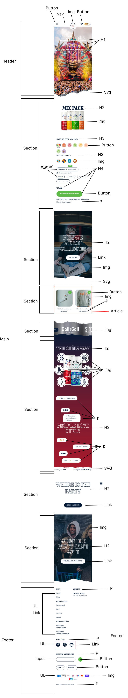
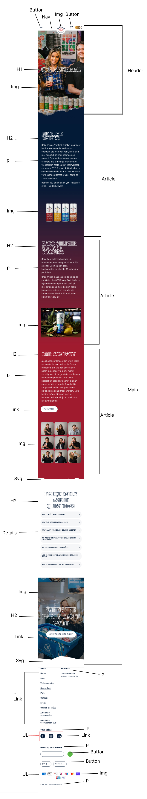
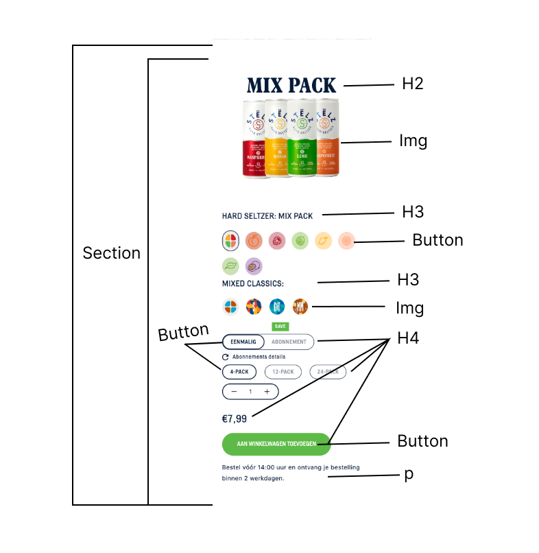
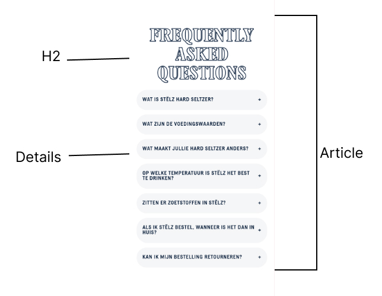
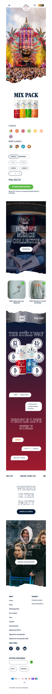
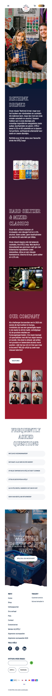
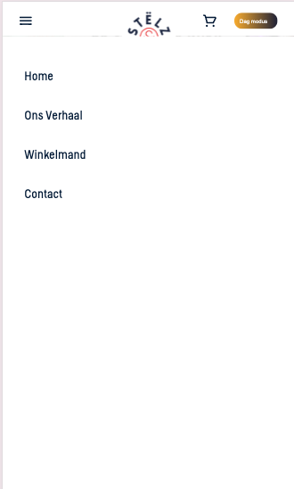
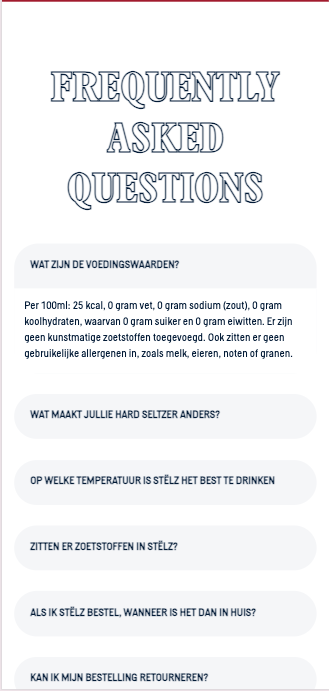
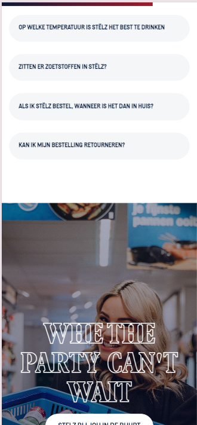
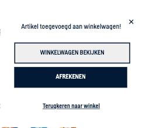

# Procesverslag

## Jij

  ### Auteur:
  Elin Esfjan

  #### Je startniveau:
  Rood 

  #### Je focus:
  Surface plane
 

## Je website

  
uitwerken voor kick-off werkgroep

  ### Je opdracht:
  https://drinkstelz.com/

  #### Screenshot(s) van de eerste pagina (small screen): 
  drinkstelz  
  

  #### Screenshot(s) van de tweede pagina (small screen):
  drinkstelz    
    
 

## Toegankelijkheidstest 1/2 (week 1)

  
uitwerken na test in 2e werkgroep

  ### Bevindingen
  Lijst met je bevindingen die in de test naar voren kwamen:
  - De eerste test met elastiekjes om de vinger zorgde ervoor dat je minder snel kan scrollen en typen.
  - Het eerste wat ik merk is dat de screenreader heel snel opleest.
  - De screenreader leest wel eens dingen op die niet zichtbaar staan.
  - De 4 stelzer blikjes worden alle 4 apart genoemd wat zorgt voor een chaotische luisterervaring. De screenreader kan beter zeggen 4 stelze blikjes en dan de smaken op noemen. 
  - Wanneer ik meer dan 1 stelz blikje kies leest de screenreader in het engels op dat de quantity verhoogt is, dit kan verwarrend zijn.
  - De screenreader leest de prijs niet op, ook als ik er op klik.
  - De screenreader geeft aan dat mijn curser op een knop is als ik erop klik, niet hover.
  - De screenreader geeft aan dat ik me op een afbeelding verbind en hoe ik ermee kan interacteren.
  - De screenreader beschrijft alleen de stelzer blikjes afbeeldingen. De afbeeldingen dat dienen als achtergronden worden niet beschreven.
  - De screenreader geeft niet aan wanneer ik switch tussen dark en light mode, hij zegt alleen dat ik me op een afbeelding bevind.

## Breakdownschets (week 1)

  
uitwerken na afloop 3e werkgroep

  ### de hele pagina: 
  
    

  ### dynamisch deel (bijv menu): 
  

  ### wellicht nog een dynamisch deel (bijv filter): 
  

## Voortgang 1 (week 2)

  
uitwerken voor 1e voortgang

  ### Stand van zaken
  - breakdownschets nog niet volledig af
  - Html deels af
  - Geen styling

  ### Agenda voor meeting
  samen met je groepje opstellen

  | student 1      | student 2          | 
  | ---            | ---                | 
  | is mijn tweede | hoe zet ik een     | 
  | pagina een     | grote svg in mijn  |
  | goede keuze    | html               |

  ### Verslag van meeting
  Uitkomsten van de meeting:

  - Bij mijn website was de afbeelding van het gescheurde blad een svg, de docent toonde mij hoe ik deze kan downloaden via de code. 
  - Het is beter om eerst mijn breakdownschets uit te werken, voordat ik aan de slag ga met mijn html. 
  - Bij één student was zijn tweede pagina te makkelijk omdat hij een element kon copy en pasten. 
  - H1 kan ik met break points onder elkaar zetten, dit doe ik zodat mijn eerste tekst op de pagina een H1 is.

## Voortgang 2 (week 3)

  
uitwerken voor 2e voortgang

  ### Stand van zaken
  - Veel html
  - Weinig Styling

  ### Agenda voor meeting
  samen met je groepje opstellen

  | student 1      | student 2          | student 3            | 
  | ---            | ---                | ---                  | 
  | moet ik alle   | hoe moet je uit-   | Moet surface plane   | 
  | scroll img     | -klapbare elementen| zelfde zijn of       | 
  | uitwerken?     | uitwerken?         | mag je ht zelf weten?| 

  ### Verslag van meeting
  hier na afloop snel de uitkomsten van de meeting vastleggen

  - Iemand naast me vroeg of ze wanneer ze meerdere afbeeldingen heeft die zij moet scrollen of ze alles moet uitwerken. 
  - Ook vroeg ze hoe je uitklapbare elementen moet coderen.
  - Vraag van mij: Moet surface plane animaties net als site zijn of mag je het zelf verzinnen?
  - Eerst globale styling dan verder gaan
  - Je mag classes gebruiken maar begin eerst met NTH of type per section bijvoorbeeld. Als het heel lang word mag je classes gebruiken.
  - Ik hoefde niet al mijn styling te veranderen ik kon het gewoon wijzigen.
  - Ik heb aangegeven dat ik gewoon aan de slag moet gaan en dat ik verder geen vragen heb. 
  - Bij een andere student werd aangegeven dat ze in plaats van px em's moet gebruiken.

  Studentassistente Jason Feedback voortgangsgesprek:
  HTML : Ziet er netjes uit. CSS : Probeer eerst nth-type te gebruiken maar een aantal classes kunnen geen kwaad voor de tweede pagina bijvoorbeeld. Je hebt wel een goed plan van aanpak maar nog niet veel styling probeer hier wat tempo achter aan te zetten.
 
  Vergeet niet je readme bij te houden en de surface plain of responsive additions.

## Toegankelijkheidstest 2/2 (week 4)

  
uitwerken na test in 9e werkgroep

  ### Bevindingen
  Lijst met je bevindingen die in de test naar voren kwamen (geef ook aan wat er verbeterd is):
  - Tijdens de les hebben wij de WCAG checklist ingevoerd met andere klasgenoten. De test heb ik uitgevoerd met Louise en Wieke. Ik vond de test erg fijn omdat het mij veel inzicht gaf in de toegankelijkheid en andere belangrijke elementen van mijn site. Het gaf mij een zeker gevoel over mijn document. 

## Voortgang 3 (week 4)

  
uitwerken voor 3e voortgang

  ### Stand van zaken
  - Html grotendeels af
  - Css veel vooruitgewerkt
  - Een aantal vragen over bepaalde elementen

  ### Verslag van meeting
  hier na afloop snel de uitkomsten van de meeting vastleggen

  - Ik heb een artikel link gekregen voor de scroll animatie, dit is op een andere manier dat duidelijker is. 
  - Ik heb tips gekregen voor mijn surface planes, de studentassistente vonden dat een aantal van mijn surface plane ideeën te veel op elkaar leken.
  - Ik heb opgeschreven dat ik goed moet nadenken over mijn surface planes.
  - Er moet meer tempo achteraan, doordat ik vaak ziek ben loop ik erg achter. 

  Studentassistente Jesse Kramer Feedback voortgangsgesprek:
  Pagina 1 ziet er echt goed uit, voor je "switch" kan je een checkbox gebruiken en deze gaan stylen. Je denkt al goed na over surface plane. Kijk nog even naar custom properties. Pagina 2 gaat ook de goede kant op, let op specifity bij het gebruik van je CSS classes zodat je niet !important hoeft te gebruiken. Bekijk ook: https://codepen.io/oliviale/details/mgWjpq , https://developer.mozilla.org/en-US/docs/Web/CSS/Using_CSS_custom_properties , https://medium.com/@mintpw/how-to-create-infinite-horizontal-scroll-and-hover-pause-with-pure-css-b052caa683bd ,https://scroll-driven-animations.style/

## Eindgesprek (week 5)

  
uitwerken voor eindgesprek

  Tijdens mijn eindgesprek liep ik nog steeds erg achter. Het gesprek gaf mij wel hoop dat het nog kon lukken. Toen de deadline naderde merkte ik dat ik het niet zou redden. Ik wou het project niet afraffelen door het fout te doen dus heb ik besloten om toch voor de herkansing te gaan. Dit is de eerste keer dat ik in heel mijn school carriére voor een herkansing ga, normaal laat ik mezelf dit niet toe. Maar vanwege mijn situatie kon ik het loslaten en toch mijn best doen voor de herkansing.

## Hekansing 

  ## Waarom heb ik een herkansing?
  - Tijdens dit vak ben ik vaak ziek geweest. Ik heb mijn best gedaan om mijn gemiste werk in te halen maar ik heb het niet gered. Ik zet de vakantie in om er volledig op te focussen.
  - Dit is de eerste keer dat ik een vak niet op tijd heb gered, vorig jaar ben ik cumlaude voor mijn p geslaagd. Het was onverwachts voor mij, maar ik heb er wel van geleerd.

  ## Toegankelijkheids test 3
  Na het afmaken van mijn website heb ik er voor gekozen om nog 1 toeganjelijkheidstest uit te voeren. Ik heb hiervoor de screenreader gebruikt. Resultaten:
  - De screenreader leest elke tekst duidelijk op. 
  - De screenreader geeft aan of een tekst een h1, h1 of p is. 
  - De screenreader leest alle 'alt' kopjes van de afbeeldingen op.
  - Tijdens het bestel section geeft de reader aan dat de afbeelding bij de flavours hoort. 
  - De prijs word ook opgelezen.
  - Wanneer de gebruiker de hoeveelheid wilt veranderen leest de screenreader op dat er een - en + is zodat de gebruiker weet waar hij of zij moeten klikken.

  
uitwerken voor eindgesprek

  ### Je uitkomst - karakteristiek screenshots:
  
    

  ### Dit ging goed/Heb ik geleerd: 
  Tijdens dit project heb ik erg veel geoefend met animaties en keyframes. Op het begin ging dit niet altijd soepel maar ik ben er veel beter in geworden. 
  
  
  
  

  Ik heb veel progress gemaakt met mijn skill van Javascript. Het ging niet altijd vlekkeloos, uiteindelijk is het heel erg goed gegaan en heb ik geleerd hoe je verschillende dingen kan doen via javascript. Van het schrijven van een burgermenu, tot het schrijven van FAQ elementen. 
  
  

  Tijdens de feedbackgesprekken had ik met de docent besproken om de FAQ via details uit te werken. Dit was in eerste instantie de bedoeling, ik had even ingelezen en kwam tot de conclusie dat ik denk dat ook via javascript kan proberen. Dit was inmiddels mijn laatste javascript functie, waardoor ik al veel handiger was met javascript. 
  

  Achteraf vond ik mijn site ingewikkeld met veel animaties en visuele elementen wat mij veel extra tijd heeft gekost. Na dit allemaal gedaan te hebben, heb ik wat eigen elementen toegevoegd zoals een scrollbar. Een geluid bij de pop up etc. 
  
  

  ### Dit was lastig/Is niet gelukt:
  Tijdens dit project heb ik moeite gehad met de dark- en light-mode. Het correct instellen van dark- light mode lukte niet in een keer bij mij dus heb ik chatgpt om hulp gevraagd. 

  Ook scroll animaties lukte niet in een keer, ik wou beginnen met een hele ingewikkelde scroll animatie dat ik via een artikel had gevonden. Dit was geen goede keuze, ik heb het losgelaten en ben eerst begonnen met simpele scroll animaties. Vervolgens heb ik langzaam opgebouwd. 

  Achteraf gezien vond ik het maken van de STËLZ website best uitdagend, maar ik ben ontzettend blij dat ik het heb gedaan. Het projcet heeft mijn skills rondom coderen verbeterd. Na al die uren werk merk ik hoeveel ik heb geleerd en hoeveel ik heb gehad aan doorzetten en oplossen van problemen. De problemen zorgden ervoor dat ik soms urenlang met volle concentratie aan dit project werkte om ze op te lossen. Uiteindelijk was het de moeite meer dan waard, en het resultaat voelt als een echt succces.

## Bronnenlijst

  
continu bijhouden terwijl je werkt

Here is your requested APA-style references list based on the URLs provided:

30 Seconds of Code. (n.d.). Root vs. HTML in CSS. https://www.30secondsofcode.org/css/s/root-vs-html/
CSS Gradient. (n.d.). CSS Gradient Generator. https://cssgradient.io
ExtractPics. (n.d.). Extract pics. https://extract.pics/
MintPW. (2020, February 10). How to create infinite horizontal scroll and hover pause with pure CSS. Medium. https://medium.com/@mintpw/how-to-create-infinite-horizontal-scroll-and-hover-pause-with-pure-css-b052caa683bd
Mozilla Developer Network. (n.d.). CSS color value: Light and dark. https://developer.mozilla.org/en-US/docs/Web/CSS/color_value/light-dark
Niem Vui Lap Trinh. (n.d.). 20 Example FAQ Components for Website Development. Medium. https://niemvuilaptrinh.medium.com/20-example-faq-component-for-website-development-abcfaf032c40
OpenAI. (n.d.). ChatGPT. https://chatgpt.com
Scroll Driven Animations. (n.d.). Progress bar CSS. https://scroll-driven-animations.style/demos/progress-bar/css/
Scroll Driven Animations. (n.d.). Scroll-driven animations. https://scroll-driven-animations.style
Stelz. (n.d.). Drink Stelz. https://drinkstelz.com/?srsltid=AfmBOorIaHx3lRVYcztLW9LPrGOFBkK0alpQ5_uBdt8RB5xNyTHlHnTg
W3Schools. (n.d.). CSS3 gradients. https://www.w3schools.com/css/css3_gradients.asp
W3Schools. (n.d.). How To Create a Popup Form. https://www.w3schools.com/howto/howto_js_popup_form.asp

